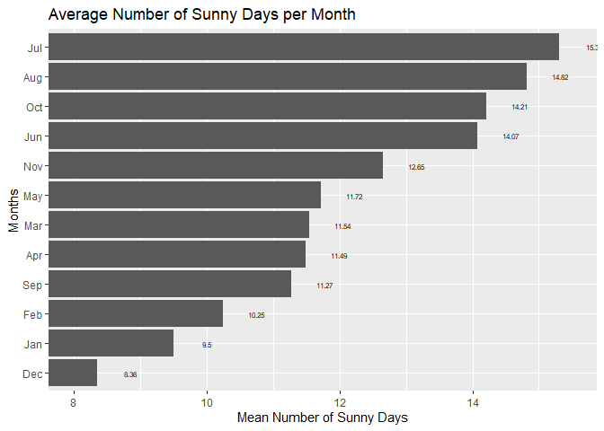
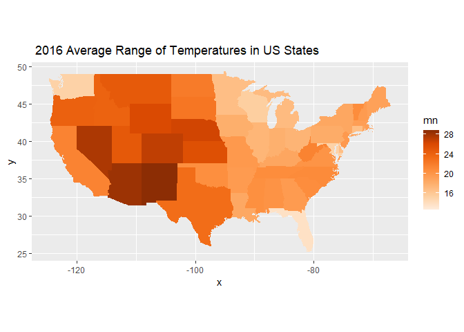

Weather Data Project
================

## 

# Team-Project-1

# 

**Partner names: Abizer Mamnoon, Luis Gomez**

## Data

The data `MonthlyWeather.csv` contain monthly weather readings for 113
US airports from July, 2014 through September, 2017. Variable
descriptions are given below. The location of this data is
<https://raw.githubusercontent.com/mgelman/data/master/MonthlyWeather.csv>.

## To do:

Use `ggplot2` to create graphs that can answer the following questions.
For each set of questions, create 1-2 graphs and use the graphs to
answer the questions in a paragraph or two. You will be graded on the
appropriateness and originality of your graphs,
explanation/interpretation, and the readability of your R code.

1.  Suppose you don’t like big daily temperature swings and cloudy days.
    Which month(s) or time of year have the most consistent daily temps?
    the most variable daily temps? Which month(s) or time of year have
    the most sunny days? the fewest sunny days?

\#The code below depicts a bar graph of the average temperature range
vs. months. The bar graph is arranged in decending order from the month
with the highest temperature range to the lowest.
<!-- -->

December has the most consistent daily temperature as the average of the
daily max - min temperature in December is the lowest at 16.1 degrees F.
June has the most variable daily temperatures as the average of the
daily max - min temperature in June is the highest at 22.4 degrees F.

\#The code below depicts a bar graph of the mean number of sunny day
vs. months. The bar graph is arranged in decending order from the month
with the highest average number of sunny days to the least
<!-- -->

December has on average 8.4 sunny days which is the lowest average
number of sunny days a month has in the year. July has on average 15.3
sunny days which is the highest average number of sunny days a month has
in the year.

2.  Consider 2016 weather data. Which regions or states have the most
    consistent daily temps? the most variable daily temps? Which regions
    or states have the most sunny days? the fewest sunny days?

\#The code below depicts a map of the US and its average temperature
range in 2016. Each US state in the map is colored with a shade of
orange that represents a temperature range. The higher the number, the
darker the shade of orange the state will be.  
<!-- -->

States in the East have more consistent temperatures than states in the
West.There are more variable temperatures in the West. Florida is the
state with the lowest average temperature range while New Mexico is
state with the highest average temperature range.

\#The code below depicts a map of the US and its average number of sunny
days range in 2016. Each US state in the map is colored with a shade of
red that represents a number of sunny days. The higher the number, the
darker the shade of red the state will be.  
<!-- -->

States in the central part of the US tend to have on average more sunny
days. While states in the midwest and North East tend to have on average
the least number of sunny days. New Mexico on average has the highest
number of sunny days while a state in the North East is the state with
the lowest number of sunny days.

3.  What criteria are important to you for choosing a city to live in?
    Create some figures that help determine which city you would live in
    based on that criteria. Would you choose one particular city to live
    in year round or would you migrate to different locations depending
    on the season?

\#The code below is the equation we came up with and it goes as follows:
as minimum temperature increases the rating increases, for wind speed
there is a negative relation as the higher the wind speed the lower the
rating, for rain we multiplied the variable by 300 in order to make it
the same range as the rest (also negative relation).

\#The code below depicts a map of the US and its average minimum
temperatures for each state in 2016. Each US state in the map is colored
with a shade of blue that represents average minimum temperature. The
higher the number, the darker the shade of blue the state will be.
<!-- -->

States in the Northern part of the US tend to have a lower average
minimum temperature while states in the south tend to have a higher
average minimum temperature.

\#The code below depicts a map of the US and its average percipitation
in 2016. Each US state in the map is colored with a shade of blue that
represents an amount of percipitation. The higher the number, the darker
the shade of blue the state will be.
<!-- -->

States in the south west part of the US tend to have the most average
amount of precipitation, with Louisiana having the most. States in the
Western part of the US tend to have the least amount of precipitation.

\#The code below depicts a map of the US and its average wind speed in
2016. Each US state in the map is colored with a shade of purple that
represents wind speed. The higher the number, the darker the shade of
purple the state will be.
<!-- --> States
around Arkansas tend to have lower wind speeds. The place with the most
wind speed is Wyioming.

<!-- --> The
equation we came up with goes as follows: as minimum temperature
increases the rating increases, for wind speed there is a negative
relation as the higher the wind speed the lower the rating, for rain we
multiplied the variable by 300 in order to make it the same range as the
rest (also negative relation). According to our bar graph, Hawaii is the
best place to live in with a score of 42.24. Most states that made it to
the top 10 are states located in the South / Western part of the US.

## Turn in:

Push your .Rmd and .md to GitHub by Tue, Sep. 27 11:59PM. Hide all code
in your knitted doc so I just see graphs, interpretations, and section
headers for each part.

## Variables:

-   `avgMinTmpF` and `avgMaxTmpF` average of daily max or min temps
-   `minTmpF` and `maxTmpF` monthly min or max temps
-   `avgTmpF` average temp
-   `avgTmpDiffF` mean of daily max - min temps
-   `avgPrecipIn` average daily precipitation (inches)
-   `maxWindMPH` monthly max sustained wind speed
-   `avgWindMPH` average of daily max sustained wind speed
-   `numSunDay` number of days that are clear/mostly sunny
-   `numDay` number of measured days
-   `AirPtCd` airport code
-   `city` closest city to the airport
-   `state` location of airport
-   `latitude`, `longitude`
-   `month`, `year`

## Grading: 66 points possible (22/part)

Each part above (1-3) will have a score determined by: score =
2\*correctness + design + presentation + style

5 point scale for

-   correctness: does code work and produce results that address the
    desired goal
-   design and originality: does the graph effectively display
    information and provide context, and/or does it convey info in a
    unique way
-   presentation: does your written explanation effectively motivate and
    explain your analysis
    -   5 = best, basically no room for improvement
    -   4 = better, minor room for improvement
    -   3 = good, some room for improvement
    -   2 = fair, ample room for improvement
    -   1 = poor, did not finish
    -   0 = no attempt

Two-point scale for

-   style and readability: is the code readable and appropriately
    commented
    -   2 = readable and sufficient comments
    -   1 = mostly readable but contains one or more portions that could
        be written in a more clear manner
    -   0 = most code could be written in a more readable manner
